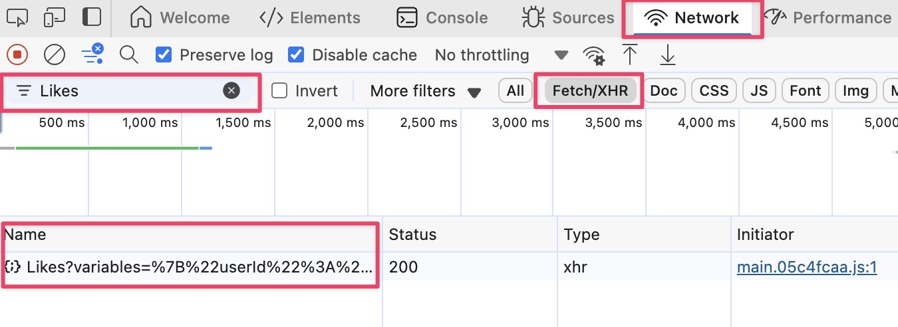
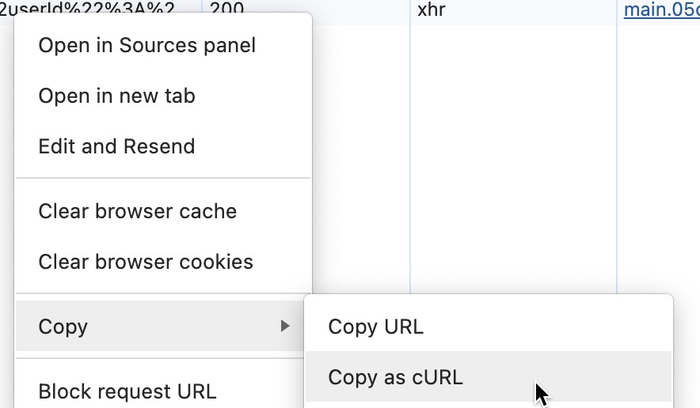

# my_x_downloader

my_x_downloader 是一个自动扫描你在 X（Twitter）上点赞的列表，并下载其中未曾保存的媒体内容（图片、视频）的工具。该项目基于
Python 实现，并结合了 twitter-media-downloader 命令行工具和直接调用 X 内部 GraphQL API 的方式来实现数据获取与媒体下载。

> **注意**：本项目需要提前生成认证 Cookies 文件和私有配置信息。请先从浏览器开发者工具中复制完整的 curl 命令（包括所有请求头和
> Cookie 数据），保存到一个文件中，然后运行 `python src/setup.py curl_command.txt` 以提取认证信息（包括
> BearerToken、UserID、AuthToken、Ct0、PersonalizationId），生成符合格式要求的 twmd_cookies.json 和 data/private_tokens.env
> 文件。

## 目录结构

```
my_x_downloader/
├── src/
│   ├── config.py            # 配置文件，包含 API 信息、下载目录、代理设置等参数，从 data/private_tokens.env 加载敏感信息
│   ├── setup.py             # 初始化个人信息：从 curl 命令解析认证信息，生成 twmd_cookies.json 和 data/private_tokens.env
│   ├── main.py              # 主流程入口：获取点赞列表并下载媒体
│   ├── x_api.py             # 直接调用 X 内部 GraphQL API 获取点赞列表
│   └── downloader.py        # 媒体下载逻辑（调用 twitter-media-downloader 命令行工具）
├── data/
│   └── mock/                # 存放 Mock 数据、twmd_cookies.json、下载记录等
├── logs/                    # 日志文件存放目录（可选）
├── .env.example             # 示例环境变量文件（不含敏感信息）
└── README.md
```

## 安装与配置

1. **安装依赖**  
   请确保已安装 Python 3.8 或更高版本，然后在项目根目录下运行：
   ```bash
   pip install -r requirements.txt
   ```

2. **配置参数修改**  
   在运行前，请根据需要修改 `config/config.py` 中的关键参数，主要包括：

   - **MOCK_MODE** 与 **MOCK_LIKED_TWEETS_FILE**：若启用 Mock 模式，需更新相应文件路径
   - **DOWNLOAD_DIR**：媒体下载的基础目录（建议保持在 data/downloads/ 下）
   - **DOWNLOAD_RECORD**：保存已处理 tweet 的 ID 的记录文件（建议保存在 data/ 下）
   - **代理设置**：HTTP_PROXY（用于内部 API 请求）和 SOCKS_PROXY（用于媒体下载）
   - **文件命名格式**：FILE_FORMAT
   - **内部 API 配置**：LIKES_API_URL、LIKES_FEATURES、LIKES_FIELDTOGGLES

   > **重要**：USER_ID、BEARER_TOKEN、auth_token、ct0 和 personalization_id 将不再出现在 .env 文件中，而是由运行
   `python src/setup.py curl_command.txt` 初始化生成，请确保该命令执行成功。

3. **初始化个人信息**  
   为初始化个人认证信息，请将从浏览器开发者工具复制的完整 curl 命令保存到一个文件（例如 curl_command.txt），然后运行：
   ```bash
   python src/setup.py curl_command.txt
   ```
   程序会解析该 curl 命令，提取出 BearerToken 以及 Cookies 中的 UserID、AuthToken、Ct0、PersonalizationId，生成符合格式要求的
   twmd_cookies.json 文件，并将这些敏感信息写入到 data/private_tokens.env 文件。
   > **复制命令方法**:
   > 1. 打开Chrome并登录X
   > 2. 打开开发者工具，找到「网络」(Network)，筛选条件设置为 「Fetch/XHR」
   > 3. 在X网页中进入自己的点赞列表，在「网络」中筛选 `Likes`
        <br/>
   > 4. 鼠标右键选中筛选到的记录，选择「复制」(Copy)，选择「复制为cURL」(Copy as cURL)。
        <br/>

## 使用方法

1. **获取点赞列表与媒体下载**  
   在配置和初始化完成后，通过运行主程序启动自动扫描和下载：
   ```bash
   python src/main.py
   ```
   主程序将：

   - 调用 X 内部 GraphQL API 获取当前用户点赞的 tweet 列表；
   - 遍历每条 tweet，调用 twitter-media-downloader 获取媒体信息并下载到 DOWNLOAD_DIR 下相应子目录；
   - 记录已下载的 tweet ID，避免重复下载。

2. **定时任务**  
   若需要定时执行（例如每隔半小时运行一次），可结合 PM2 或 Linux Cron 来实现定时任务。例如，使用 PM2 可创建
   ecosystem.config.js 文件，并通过以下命令启动：
   ```bash
   pm2 start ecosystem.config.js
   ```
   PM2 会按照配置的 cron_restart 时间间隔定时运行。

## 注意事项

- 请确保在运行前正确修改 .env 中所有需要的参数，确保目录路径正确，并且有足够权限写入文件。
- 生成的 twmd_cookies.json 和 data/private_tokens.env 文件非常重要，必须保证其有效，否则下载过程可能因认证失败而中断。
- 项目生成的所有数据（下载文件、日志、Mock 数据等）均归类到各自目录中，请定期备份或清理 data 目录。

## License

本项目遵循 MIT License，详见 [LICENSE](LICENSE) 文件。
